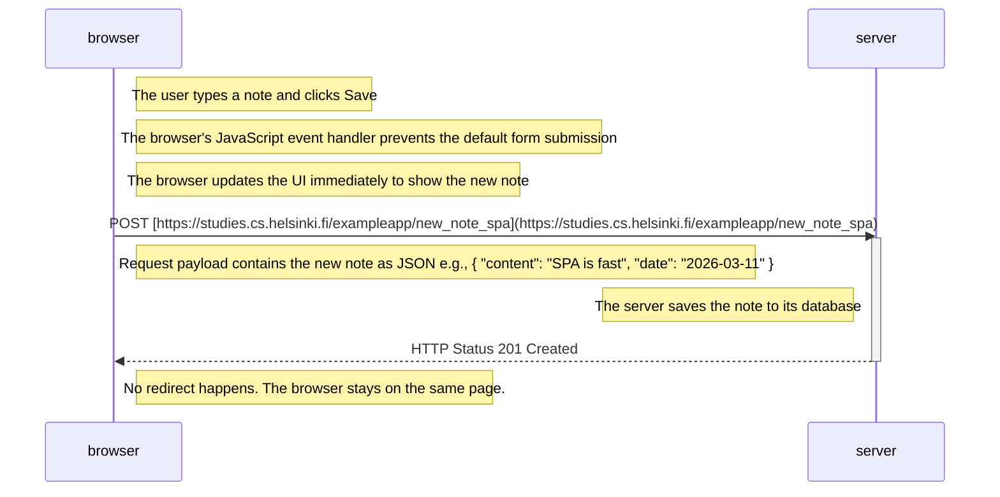

```mermaid

sequenceDiagram
    participant browser
    participant server

    Note right of browser: The user types a note and clicks Save
    Note right of browser: The browser's JavaScript event handler prevents the default form submission
    Note right of browser: The browser updates the UI immediately to show the new note
    
    browser->>server: POST [https://studies.cs.helsinki.fi/exampleapp/new_note_spa](https://studies.cs.helsinki.fi/exampleapp/new_note_spa)
    activate server
    Note right of browser: Request payload contains the new note as JSON e.g., { "content": "SPA is fast", "date": "2026-03-11" }
    Note left of server: The server saves the note to its database
    server-->>browser: HTTP Status 201 Created
    deactivate server
    
    Note right of browser: No redirect happens. The browser stays on the same page.
    
```